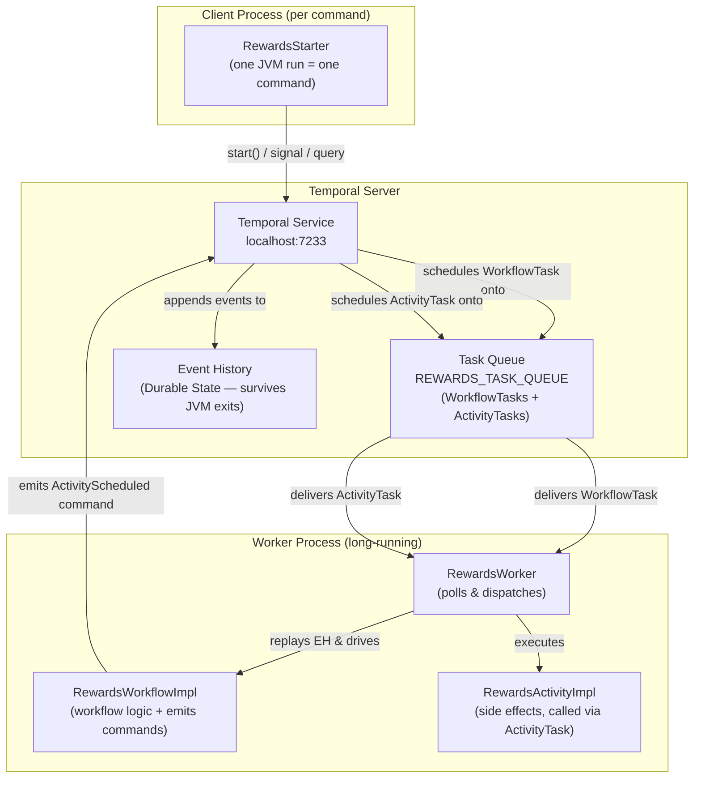
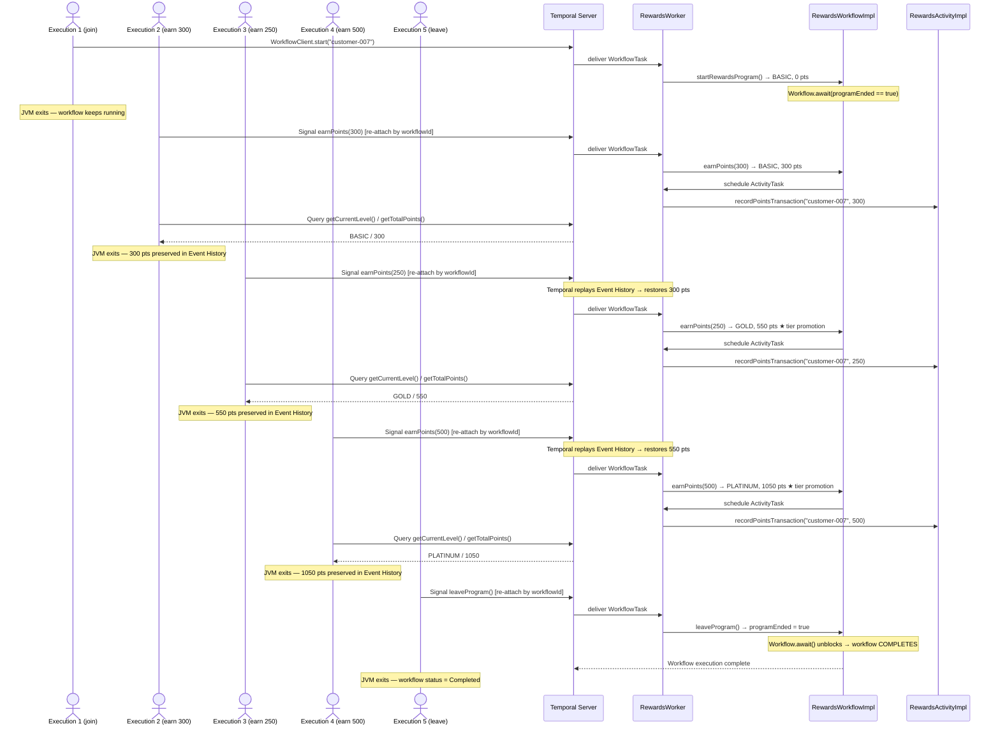
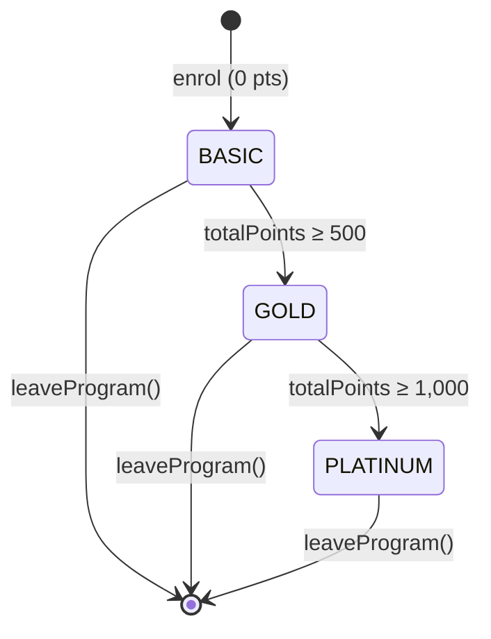

# Temporal Rewards Program Demo

A Java demonstration project showing how [Temporal](https://temporal.io) elegantly solves the hard
problems of **distributed, long-running, stateful services** — using a Retail Rewards Program as
the driving use-case.

---

## Use-Case: Rewards Program

A rewards program tracks a customer's engagement points and automatically promotes them through
three tiers:

| Level        | Points Required          |
| -------------|--------------------------|
| **Basic**    | 0 (default on enrolment) |
| **Gold**     | ≥ 500                    |
| **Platinum** | ≥ 1,000                  |

### Business Rules

* A customer **joins** the program → placed in the **Basic** tier.
* Customers **earn points** through various activities (purchases, referrals, etc.).
* The tier is **recalculated automatically** whenever points change.
* A customer can **leave** the program at any time, ending the workflow cleanly.
* Any caller can **query** the current tier and total points without disturbing the workflow.

---

## Tech Stack

| Component               | Version                   |
|-------------------------|---------------------------|
| Java                    | 25                        |
| Maven                   | 3.9.x                     |
| Temporal Java SDK       | 1.37.0                    |
| Temporal Server (local) | latest (via Temporal CLI) |

---

## Prerequisites

1. **Java 25** — [Download](https://jdk.java.net/25/)
2. **Maven 3.9.x** — [Download](https://maven.apache.org/download.cgi)
3. **Temporal CLI** — `brew install temporal`

---

## Project Structure

```
temporal_rewards_program_demo/
├── pom.xml
└── src/
    ├── main/
    │   └── java/com/bhatman/demo/temporal/rewards/
    │       ├── model/
    │       │   └── RewardLevel.java          # Enum: BASIC, GOLD, PLATINUM + forPoints()
    │       ├── workflow/
    │       │   ├── RewardsWorkflow.java       # @WorkflowInterface — signals & queries
    │       │   └── RewardsWorkflowImpl.java   # Entity workflow: state, await loop, activity call
    │       ├── activity/
    │       │   ├── RewardsActivity.java       # @ActivityInterface — recordPointsTransaction()
    │       │   └── RewardsActivityImpl.java   # Activity impl (logs transaction; swap in DB later)
    │       ├── worker/
    │       │   └── RewardsWorker.java         # Registers workflow + activity; standalone main
    │       └── starter/
    │           └── RewardsStarter.java        # CLI client — one command per JVM run
    └── test/
        └── java/com/bhatman/demo/temporal/rewards/
            └── RewardsWorkflowTest.java       # Unit tests (TestWorkflowEnvironment, no server needed)
```

---

## Running the Demo

### 1. Start the Temporal Dev Server

```bash
temporal server start-dev
```

The Web UI will be available at <http://localhost:8233>.

### 2. Build the Project

```bash
mvn clean package
```

### 3. Start the Worker

In **one terminal**, start the worker process. It will keep running and poll the task queue:

```bash
mvn compile exec:java -Dexec.mainClass="com.bhatman.demo.temporal.rewards.worker.RewardsWorker"
```

### 4. Run the Multi-Execution Demo

In a **separate terminal**, run one command at a time. Each invocation is its own JVM process that
connects to Temporal, sends a single command, then exits — **the workflow keeps running between
runs**, preserving all state in Temporal's Event History without any external database.

```
Usage: RewardsStarter <customerId> <join|earn <points>|leave|status>
```

**Execution 1 — Customer joins (workflow starts, JVM exits)**
```bash
mvn compile exec:java \
  -Dexec.mainClass="com.bhatman.demo.temporal.rewards.starter.RewardsStarter" \
  -Dexec.args="customer-007 join"
```
```
[JOIN]   Customer customer-007          enrolled.
         customer-007             level=BASIC       totalPoints=0
```

---

**Execution 2 — Earn 300 points (still Basic; JVM exits, workflow lives on)**
```bash
mvn compile exec:java \
  -Dexec.mainClass="com.bhatman.demo.temporal.rewards.starter.RewardsStarter" \
  -Dexec.args="customer-007 earn 300"
```
```
[EARN]   Customer customer-007          earned 300 points.
         customer-007             level=BASIC       totalPoints=300
```

---

**Execution 3 — Earn 250 more points → tier promotion to Gold (550 total)**
```bash
mvn compile exec:java \
  -Dexec.mainClass="com.bhatman.demo.temporal.rewards.starter.RewardsStarter" \
  -Dexec.args="customer-007 earn 250"
```
```
[EARN]   Customer customer-007          earned 250 points.
         customer-007             level=GOLD        totalPoints=550
```

> **This is Temporal at work.** The JVM from Execution 2 has long since exited. Temporal replayed
> the Event History to restore the 300-point state before applying the new 250-point signal —
> no database, no cache, no manual state management.

---

**Execution 4 — Earn 500 more points → tier promotion to Platinum (1,050 total)**
```bash
mvn compile exec:java \
  -Dexec.mainClass="com.bhatman.demo.temporal.rewards.starter.RewardsStarter" \
  -Dexec.args="customer-007 earn 500"
```
```
[EARN]   Customer customer-007          earned 500 points.
         customer-007             level=PLATINUM    totalPoints=1050
```

---

**Optional — Check status at any time (read-only, never mutates state)**
```bash
mvn compile exec:java \
  -Dexec.mainClass="com.bhatman.demo.temporal.rewards.starter.RewardsStarter" \
  -Dexec.args="customer-007 status"
```
```
[STATUS] Customer customer-007          
         customer-007             level=PLATINUM    totalPoints=1050
```

---

**Execution 5 — Customer leaves (workflow completes cleanly)**
```bash
mvn compile exec:java \
  -Dexec.mainClass="com.bhatman.demo.temporal.rewards.starter.RewardsStarter" \
  -Dexec.args="customer-007 leave"
```
```
[LEAVE]  Customer customer-007          has left the rewards program.
```

After this step the workflow appears as **Completed** in the Temporal Web UI at <http://localhost:8233>.

---

### 5. Run the Unit Tests

Tests use `TestWorkflowEnvironment` — **no running Temporal server needed**.

```bash
mvn test
```

---

## How It Maps to Temporal Concepts

| Rewards Program Concept   | Temporal Mechanism                                                           |
| --------------------------|------------------------------------------------------------------------------|
| Customer enrolling        | `WorkflowClient.start()` — begins the Entity Workflow                        |
| Customer's points & level | In-memory workflow state (durable via Event History)                         |
| Earning points            | `@SignalMethod earnPoints(int)` — fire-and-forget from any process           |
| Querying current tier     | `@QueryMethod getCurrentLevel()`                                             |
| Querying current points   | `@QueryMethod getTotalPoints()`                                              |
| Leaving the program       | `@SignalMethod leaveProgram()` — sets exit flag, unblocks `Workflow.await()` |
| Re-attaching across runs  | `client.newWorkflowStub(RewardsWorkflow.class, workflowId)` — no options needed |
| Persisting a transaction  | `@ActivityInterface` with automatic retries                                  |
| Worker crash / restart    | Temporal replays Event History → state fully restored, zero data loss        |
| Exactly-once point credit | Temporal's idempotent signal delivery + deterministic replay                 |

---

## Diagrams

### Architecture



---

### Sequence: Multi-Execution Demo Walkthrough

Each box labelled **Execution N** is a **separate JVM process** running `RewardsStarter`. All
processes exit after their single command; the workflow continues running between them.



---

### State Machine: Reward Tiers


