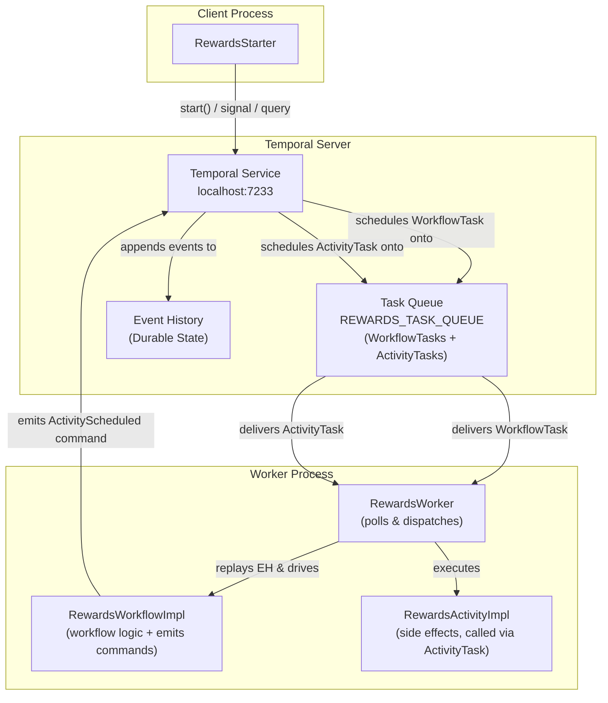
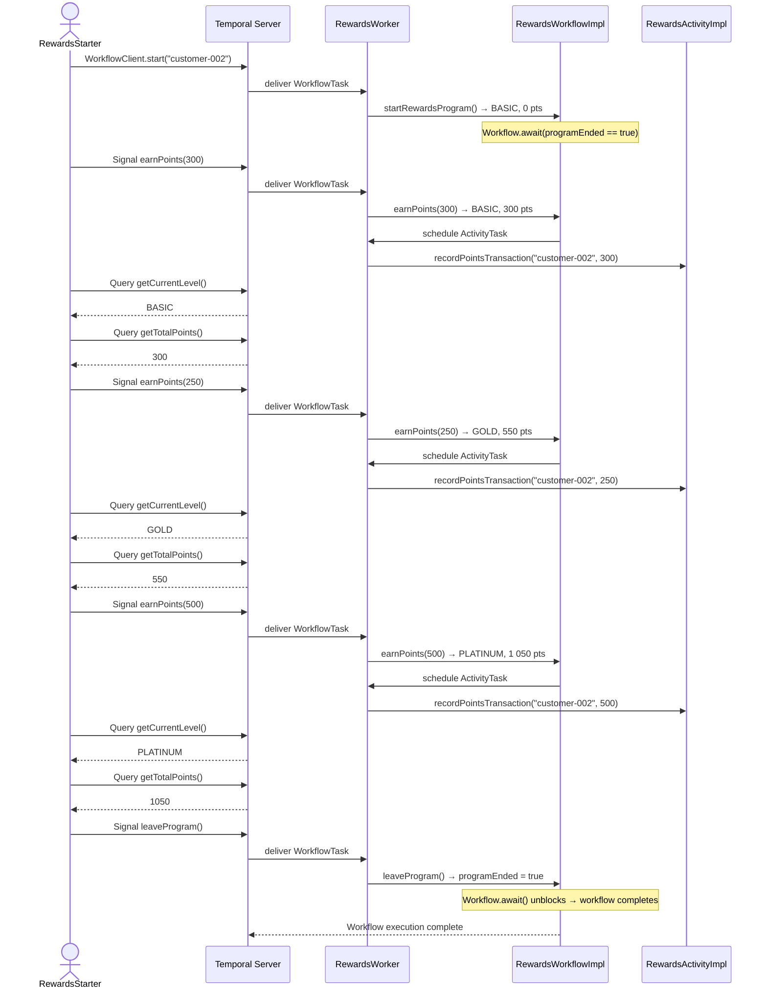
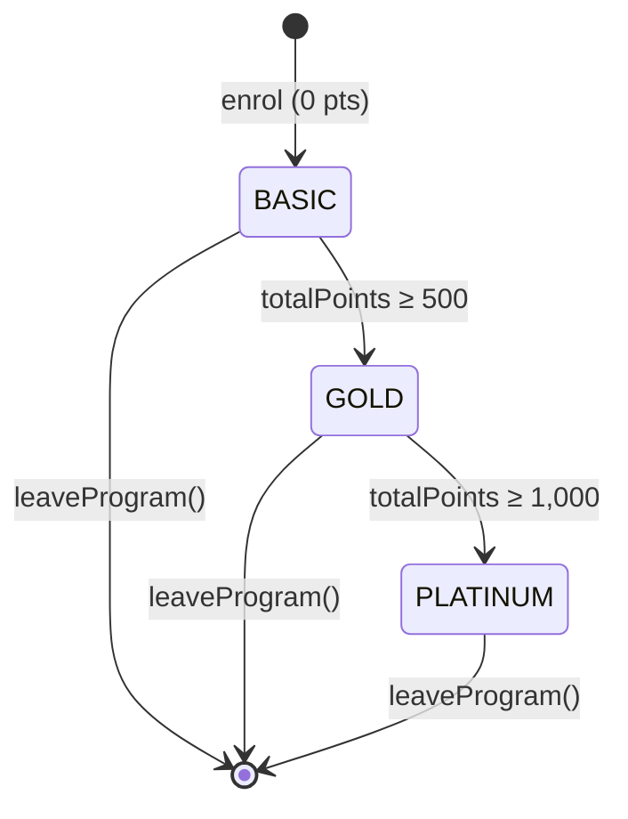

# Temporal Rewards Program Demo

A Java demonstration project showing how [Temporal](https://temporal.io) elegantly solves the hard
problems of **distributed, long-running, stateful services** — using a Retail Rewards Program as
the driving use-case.

---

## Use-Case: Rewards Program

A rewards program tracks a customer's engagement points and automatically promotes them through
three tiers:

| Level        | Points Required          |
| --------------| --------------------------|
| **Basic**    | 0 (default on enrolment) |
| **Gold**     | ≥ 500                    |
| **Platinum** | ≥ 1,000                  |

### Business Rules

* A customer **joins** the program → they are placed in the **Basic** tier.
* Customers **earn points** through various activities (purchases, referrals, etc.).
* The tier is **recalculated automatically** whenever points change.
* A customer can **leave** the program at any time, ending the workflow cleanly.
* Any caller can **query** the current tier and total points without disturbing the workflow.

---

## Tech Stack

| Component               | Version   |
|-------------------------|-----------|
| Java                    | 25        |
| Maven                   | 3.9.x     |
| Temporal Java SDK       | 1.37.0    |
| Temporal Server (local) | latest (via Temporal CLI) |
| Logging                 | slf4j-nop 2.0.x           |

---

## Prerequisites

1. **Java 25** — [Download](https://jdk.java.net/25/)
2. **Maven 3.9.x** — [Download](https://maven.apache.org/download.cgi)
3. **Temporal CLI** — `brew install temporal`

---

## Project Structure

```
temporal_rewards_program_demo/
├── pom.xml
└── src/
    ├── main/
    │   └── java/com/bhatman/demo/temporal/rewards/
    │       ├── model/
    │       │   └── RewardLevel.java          # Enum: BASIC, GOLD, PLATINUM + forPoints()
    │       ├── workflow/
    │       │   ├── RewardsWorkflow.java       # @WorkflowInterface — signals & queries
    │       │   └── RewardsWorkflowImpl.java   # Entity workflow: state, await loop, activity call
    │       ├── activity/
    │       │   ├── RewardsActivity.java       # @ActivityInterface — recordPointsTransaction()
    │       │   └── RewardsActivityImpl.java   # Activity impl (logs transaction; swap in DB later)
    │       ├── worker/
    │       │   └── RewardsWorker.java         # Registers workflow + activity; standalone main
    │       └── starter/
    │           └── RewardsStarter.java        # Demo runner — enrols, signals, queries, leaves
    └── test/
        └── java/com/bhatman/demo/temporal/rewards/
            └── RewardsWorkflowTest.java       # Unit tests (TestWorkflowEnvironment, no server needed)
```

---

## Running the Demo

### 1. Start the Temporal Dev Server

```bash
temporal server start-dev
```

The Web UI will be available at <http://localhost:8233>.

### 2. Build the Project

```bash
mvn clean package
```

### 3. Start the Worker

In **one terminal**, start the worker process. It will keep running and poll the task queue:

```bash
mvn compile exec:java -Dexec.mainClass="com.bhatman.demo.temporal.rewards.worker.RewardsWorker"
```

### 4. Run the Demo Starter

In a **separate terminal**, run the starter.

**Default** (uses the built-in sample customer `BhatMan-Returns-007`):

```bash
mvn compile exec:java -Dexec.mainClass="com.bhatman.demo.temporal.rewards.starter.RewardsStarter"
```

**Custom customer** (pass any customer ID as the first argument):

```bash
mvn compile exec:java -Dexec.mainClass="com.bhatman.demo.temporal.rewards.starter.RewardsStarter" -Dexec.args="customer-42"
```

The starter will:
1. Enrol a new customer (starts the workflow — **Basic** tier, 0 points).
2. Signal 300 points earned → still **Basic** (300 total).
3. Signal 250 more points → promoted to **Gold** (550 total).
4. Signal 500 more points → promoted to **Platinum** (1,050 total).
5. Signal the customer to leave the program (workflow completes).

### 5. Run the Unit Tests

Tests use `TestWorkflowEnvironment` — **no running Temporal server needed**.

```bash
mvn test
```

---

## How It Maps to Temporal Concepts

| Rewards Program Concept   | Temporal Mechanism                                                           |
| ---------------------------| ------------------------------------------------------------------------------|
| Customer enrolling        | `WorkflowClient.start()` — begins the Entity Workflow                        |
| Customer's points & level | In-memory workflow state (durable via Event History)                         |
| Earning points            | `@SignalMethod earnPoints(int)`                                              |
| Querying current tier     | `@QueryMethod getCurrentLevel()`                                             |
| Querying current points   | `@QueryMethod getTotalPoints()`                                              |
| Leaving the program       | `@SignalMethod leaveProgram()` — sets exit flag, unblocks `Workflow.await()` |
| Persisting a transaction  | `@ActivityInterface` with automatic retries                                  |
| Worker crash / restart    | Temporal replays Event History → state fully restored, zero data loss        |
| Exactly-once point credit | Temporal's idempotent signal delivery + deterministic replay                 |

---

## Diagrams

### Architecture



---

### Sequence: Demo Walkthrough



---

### State Machine: Reward Tiers


